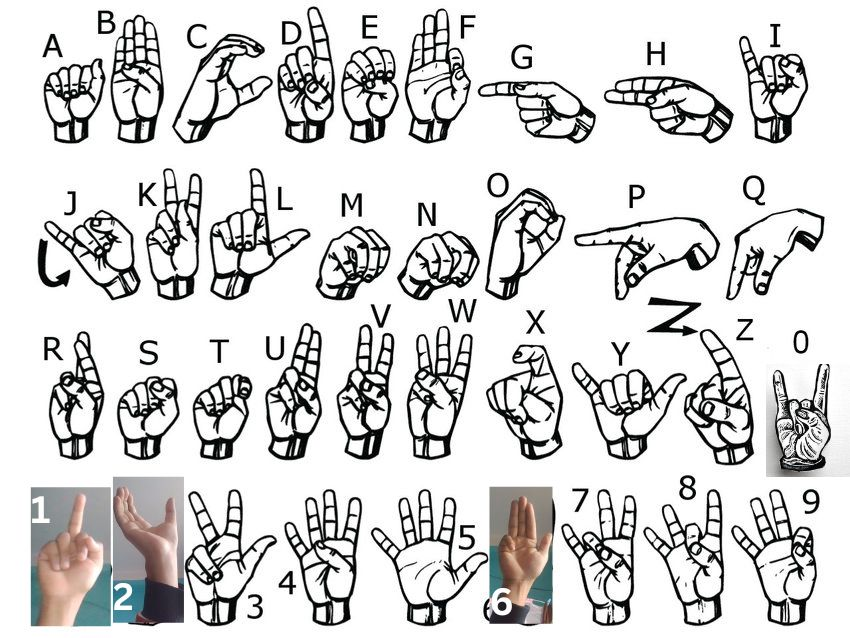

# American Sign Language (ASL) Detection System

## Overview
This project is an American Sign Language (ASL) detection system that recognizes hand gestures using computer vision and machine learning and converts them into speech.  
The system uses **Mediapipe** for hand landmark detection, a pre-trained model for gesture classification, and **Text-to-Speech (TTS)** for converting recognized text into speech.  
The graphical user interface (GUI) is built using **Tkinter**.



## Features
- **Real-time ASL detection** using webcam  
- **Hand landmark detection** with Mediapipe  
- **Machine learning-based gesture classification**  
- **Automatic word and sentence formation** from detected gestures  
- **Text-to-Speech (TTS) conversion** for speaking out sentences  
- **Graphical User Interface (GUI)** for interaction  
- **Pause, Reset, and Speak Sentence options**  

## Project Workflow
1. **Video Capture:** The system captures video frames from the webcam.  
2. **Hand Detection:** Mediapipe detects hand landmarks in the video frame.  
3. **Feature Extraction:** The system extracts hand landmark coordinates.  
4. **Gesture Classification:** A trained ML model predicts the ASL gesture.  
5. **Text Formation:** Recognized gestures are formed into words and sentences.  
6. **Speech Conversion:** The final sentence is converted into speech using TTS.  
7. **GUI Interaction:** Users can view recognized gestures, sentences, and control the system via buttons.  


## Installation

### Prerequisites
Ensure you have Python installed (version 3.x recommended). Install dependencies using:  
```bash
pip install -r requirements.txt
```
## Required Libraries
1. OpenCV (cv2)
2. Mediapipe
3. Numpy
4. Tkinter (built-in in Python)
5. Pyttsx3 (for Text-to-Speech)
6. Pickle (for model loading)

### Running the Project
To start the ASL detection system, run:
```bash
python Main.py
```
